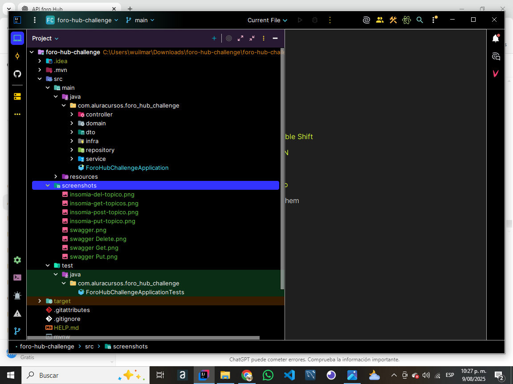
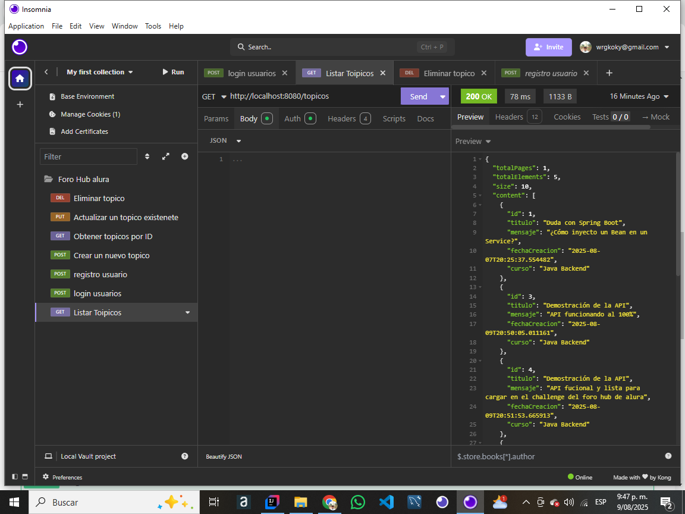
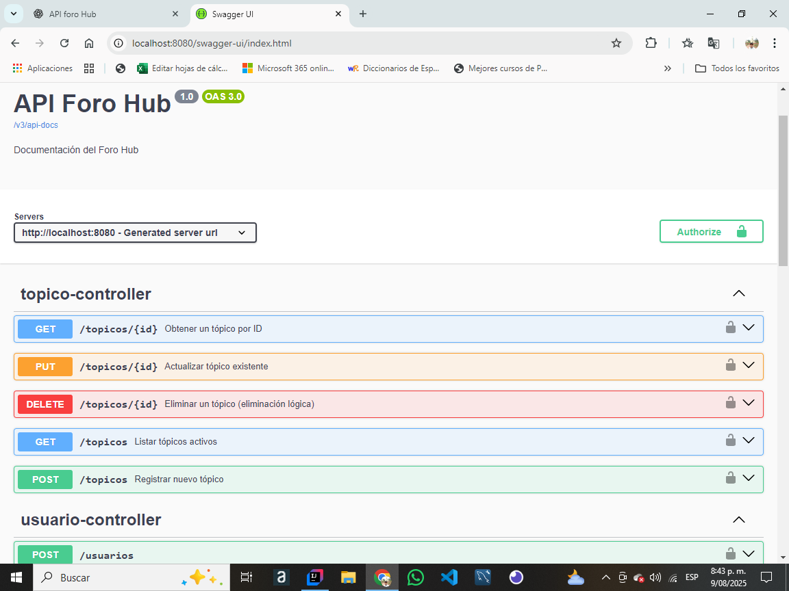
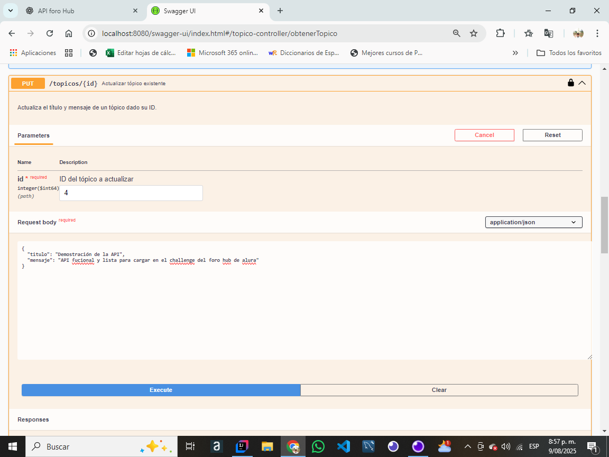

# 🚀 Foro-Hub-Challenge

**Foro-Hub-Challenge** es una API REST integral para la gestión de un foro en línea. Permite a los usuarios interactuar con tópicos y cursos a través de operaciones CRUD (Crear, Leer, Actualizar y Borrar). El proyecto está construido con **Spring Boot** y sigue las mejores prácticas para garantizar la seguridad, la validación de datos y la documentación de la API. Este proyecto fue desarrollado como parte del **Challenge de Alura Latam - Programa ONE**.

---

### **## ✨ Características Principales**

* **Autenticación y Autorización** robusta con **Spring Security** y **JSON Web Tokens (JWT)**.
* **API RESTful** para la gestión completa de tópicos.
* **Validaciones** de datos para garantizar la integridad de la información.
* **Documentación interactiva** de la API con **Swagger UI**.
* **Conexión a Base de Datos** con **JPA / Hibernate** y **MySQL**.

---

### **## 🛠️ Tecnologías Utilizadas**

* **Java 21**
* **Spring Boot 3.x**
* **Spring Security**
* **JWT**
* **JPA / Hibernate**
* **MySQL**
* **Maven 3.8+**
* **Swagger - OpenAPI**
* **Lombok**

---

### **## 📋 Requisitos Previos**

Para ejecutar este proyecto, necesitas tener instalado:

* **Java JDK 21** o superior.
* **Maven 3.8+**
* **MySQL Server**
* Un IDE como **IntelliJ IDEA** o **Visual Studio Code**.

---

### **## ⚙️ Configuración y Ejecución**

1.  **Clona el repositorio** en tu máquina local:
    ```bash
    git clone [https://github.com/wilmar1983/Foro-Hub-Challenge.git](https://github.com/wilmar1983/Foro-Hub-Challenge.git)
    cd Foro-Hub-Challenge
    ```

2.  **Configura la base de datos**
    * Crea una base de datos llamada `foro_hub` en tu servidor MySQL.
    * Edita el archivo `src/main/resources/application.properties` con tus credenciales de base de datos.
        ```properties
        spring.datasource.url=jdbc:mysql://localhost:3306/foro_hub
        spring.datasource.username=tu_usuario
        spring.datasource.password=tu_contraseña
        ```

3.  **Ejecuta la aplicación**
    * Desde la terminal, en el directorio raíz del proyecto:
        ```bash
        mvn spring-boot:run
        ```
    * Alternativamente, puedes ejecutar la clase principal `ForoHubChallengeApplication` directamente desde tu IDE.

---

### **## 🔐 Autenticación con JWT**

1.  **Paso 1: Obtener el Token**
    Envía una petición `POST` a `/login` con el `email` y `password` del usuario. El sistema validará las credenciales y te devolverá un token JWT.

2.  **Paso 2: Usar el Token**
    Para acceder a los endpoints protegidos, debes incluir este token en el encabezado de cada petición.
    **Encabezado de ejemplo:**
    `Authorization: Bearer <tu-token-jwt>`

---

### **## 📌 Endpoints de la API**

Puedes encontrar la documentación completa de la API en la siguiente URL después de iniciar la aplicación:
`http://localhost:8080/swagger-ui.html`

| Método | Endpoint                    | Descripción                                      | Autenticación |
|--------|-----------------------------|--------------------------------------------------|---------------|
| `POST` | `/login`                    | Autentica un usuario y devuelve el JWT           | ❌ No         |
| `GET`  | `/topicos`                  | Lista todos los tópicos                          | ✅ Sí         |
| `GET`  | `/topicos/{id}`             | Obtiene un tópico por su ID                      | ✅ Sí         |
| `POST` | `/topicos`                  | Crea un nuevo tópico                             | ✅ Sí         |
| `PUT`  | `/topicos/{id}`             | Actualiza un tópico existente                    | ✅ Sí         |
| `DELETE` | `/topicos/{id}`             | Elimina un tópico                                | ✅ Sí         |

---

### **## 🖼️ Capturas de Pantalla**

Añade aquí las imágenes para ilustrar las funcionalidades o la estructura del proyecto.





---

### **## 📜 Licencia**

Este proyecto está bajo la Licencia MIT. Consulta el archivo [[LICENSE](LICENSE)] para más detalles.

---

### **## 🧑‍💻 Desarrollado por**

* **Wilmar Rivera Gomez**
* **LinkedIn:** [link](http://www.linkedin.com/in/wilmar-rivera-gómez-4b2594346)
* **GitHub:** [link](https://github.com/wilmar1983/)